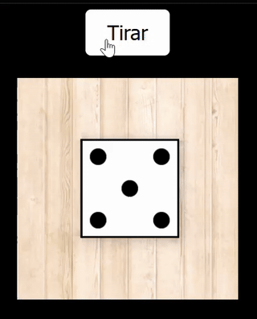

# 🎲 Juego de Tirar un Dado en 3D (100% No-Code)

Este proyecto demuestra cómo se puede desarrollar un **juego interactivo de tirar un dado en 3D** sin escribir código manualmente, utilizando únicamente **técnicas de prompting** con **IA generativa**.  

🕒 **Creado en menos de 60 minutos.**  

## 🚀 Descripción
- Creado bajo el paradigma **No-Code**, sin escribir una sola línea de código manualmente.
- **Desarrollado con ChatGPT-4o** en una **cadena de 7 prompts** para lograr el resultado final.
- Se han realizado mejoras con **Gemini, DeepSeek, Perplexity, Codeium y GitHub Copilot**. Sin embargo, las últimas 3 fueron descartadas por no lograr un resultado funcional.

---

## 🔬 **Experimento 1: Creación con Múltiples Prompts**
Se utilizó **ChatGPT-4o** en una **cadena de 7 prompts** para perfeccionar el juego.  
Después, el mismo proceso se intentó con otras IAs:

### 🔹 **Resultados con múltiples prompts**:
✅ **ChatGPT-4o** → *Resultado final óptimo.*  
✅ **Gemini 2.0 Flash, DeepSeek-V3** → *Resultado bastante bueno, pero con detalles a corregir.*  
❌ **Perplexity AI (Claude), Codeium y GitHub Copilot** → *No consiguieron un resultado funcional.*  

## 🎥 Vista Previa (ChatGPT-4o)

---

## 🔥 **Experimento 2: Creación con un Solo Prompt Final**
Una vez obtenido un **prompt optimizado** con ChatGPT-4o, se probó en diferentes IAs para ver si podían generar el juego **de una sola vez, sin ajustes adicionales**.

### 🔹 **Resultados con un solo prompt**:
✅ **Gemini 2.0 Flash** → *Consiguió un resultado aceptable (con algunos errores), aunque inferior al obtenido con múltiples prompts en ChatGPT-4o.*  
❌ **ChatGPT-4o, DeepSeek, Perplexity, Codeium, GitHub Copilot** → *No lograron un resultado funcional.*  

## 🎥 Vista Previa (Gemini 2.0 Flash)

📌 **Conclusión:** Aunque **ChatGPT-4o fue el más efectivo con múltiples prompts**, **Gemini 2.0 Flash** fue la única IA capaz de acercarse a un buen resultado con **un solo prompt**.

---

## 🎮 Características del Juego
- **Dado en 3D realista con animación fluida**.
- **Puntos tradicionales en lugar de números**.
- **Fondo negro y tablero de madera** para un diseño atractivo.
- **Generado 100% por IA**, sin intervención manual.

## 🛠️ Tecnologías Utilizadas
- **ChatGPT-4o** *(generación del código en múltiples iteraciones)*
- **Gemini, DeepSeek, Perplexity, Codeium, GitHub Copilot** *(evaluación y pruebas)*
- **HTML + CSS + JavaScript** *(código final)*
- **CodePen** *(pruebas en vivo)*

---

## 🎮 **Cómo Probar el Juego**
Puedes probar el juego de dos maneras:

### ✅ **Opción 1: Ejecutar el código localmente**
1. Descarga los archivos del repositorio.
2. Abre `index.html` en un navegador.

### 🌐 **Opción 2: Ejecutarlo en CodePen**  
Prueba la versión online directamente desde mi perfil de CodePen:

🔹 **Versión ChatGPT-4o** → [Abrir en CodePen](https://codepen.io/Jonatan-S/pen/MYWjaBv)  
🔹 **Versión Gemini 2.0 Flash** → [Abrir en CodePen](https://codepen.io/Jonatan-S/pen/KwKgdxm)  
 
[🌍 Mi perfil en CodePen](https://codepen.io/Jonatan-S)  

---

## 📜 Conclusión
Este proyecto demuestra el **potencial de las IAs para generar software sin escribir código**, pero también **sus límites**.  

✅ **ChatGPT-4o fue la mejor IA con múltiples prompts.**  
✅ **Gemini 2.0 Flash fue la única que logró un resultado aceptable con un solo prompt.**  
❌ **Otras IAs no alcanzaron un resultado funcional.**  

⏳ **Todo el proceso se completó en menos de 60 minutos, incluyendo iteraciones y pruebas.**  

---

## 📜 Licencia
Este proyecto es de código abierto y puedes modificarlo libremente.

✨ **Desarrollado como parte del curso "Azure AI Engineer".**
